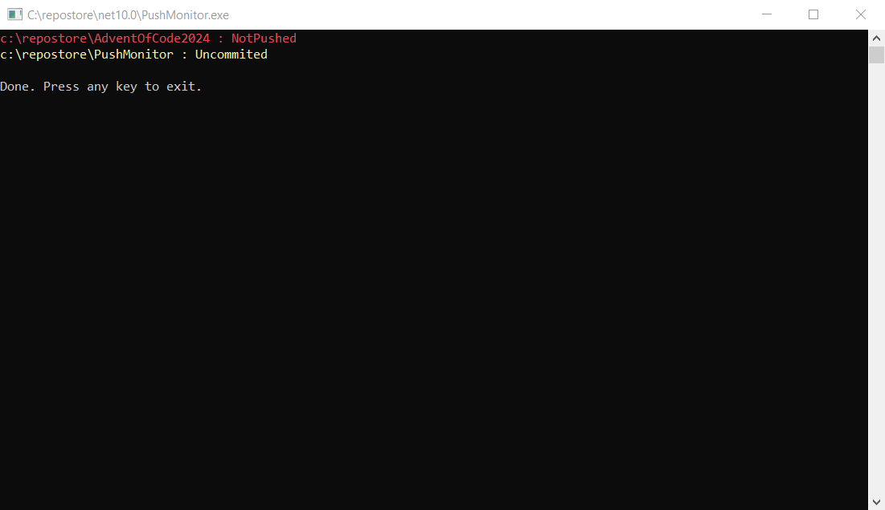

# PushMonitor

## Overview

Sometimes it's convenient to make multiple commits locally and push them later. The problem is that it's easy to forget to push before shutting down your computer. Later you realize that all your commits are still only on your local machine.

PushMonitor helps avoid this situation. It scans repositories and reports commits that have not been pushed to the remote.

## Features

* Recursively scans all directories inside the specified path
* Detects Git repositories with unpushed commits
* Supports Git submodules

## Usage

Run the program with the root directory as an argument:

```cmd
PushMonitor C:\repostore\
```

The program recursively scans all directories inside the specified path and reports repositories that contain commits which have not been pushed.

## Example Output

Example of program execution:


